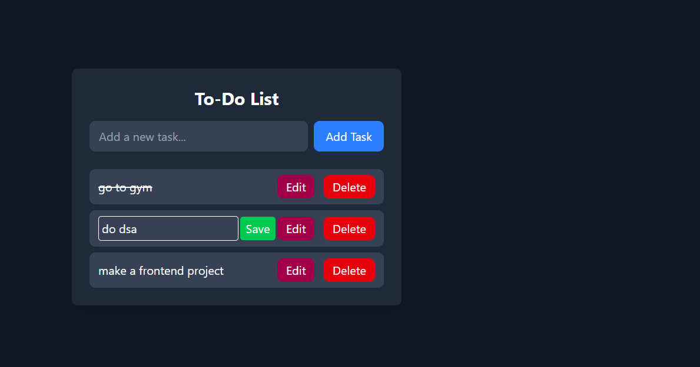

# To-Do List App

A simple, interactive To-Do List web application built with Vanilla JavaScript and styled using Tailwind CSS.  
The app allows users to add, edit, mark as complete, and delete tasks with data persistence using `localStorage`.

---

## Demo

  


---

## Features

- Add new tasks  
- Edit existing tasks inline  
- Mark tasks as completed (toggle line-through)  
- Delete tasks  
- Tasks are saved in `localStorage` for persistence across browser sessions  
- Responsive and styled with Tailwind CSS  

---

## Technologies Used

- HTML5  
- CSS3 with [Tailwind CSS](https://tailwindcss.com/)  
- Vanilla JavaScript (ES6+)  
- Browser `localStorage` API  

---

## Installation and Setup

1. **Clone the repository**

```bash
git clone https://github.com/yourusername/todo-list-app.git
=======
# Todo_Localstorage
>>>>>>> 0e724cdeb6d6644ff6b8986d616f08ccc8c4d278
